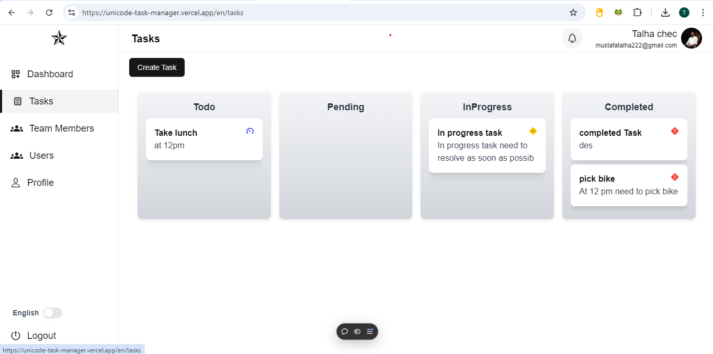
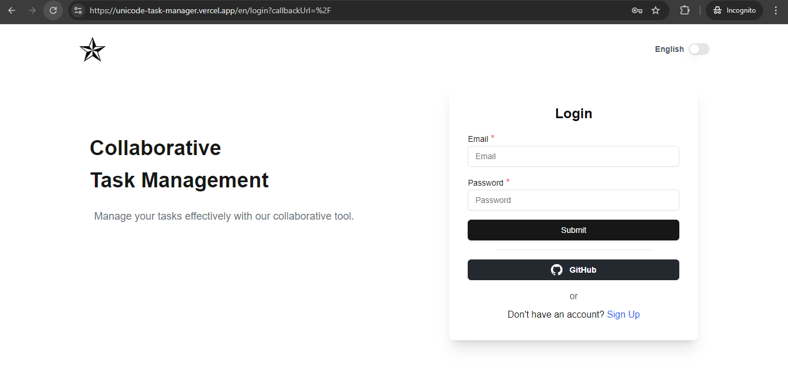

# Next.js Real-Time Collaborative Task Management Tool

## Overview

This project is a collaborative task management tool built using **Next.js**. It provides an efficient platform for users to Create team members and Manage Task effectively.

## Live Demo

[App Link](https://unicode-task-manager.vercel.app/)

## Table of Contents

- [Overview](#overview)
- [Live Demo](#live-demo)
- [Features](#features)
- [Installation](#installation)
- [Docker Image Run](#docker-image-run)
- [Usage](#usage)
- [Screenshots](#screenshots)

## Features

- **Framework**: Utilizes **Next.js** for both front-end and back-end, integrated with \*_MongoDb_.
- **Real-Time Communication**: Task status update on realtime using **Socket.io**.
- **Authentication**: Integrated **NextAuth** for user authentication, with middleware set up for verifying API requests on both front-end and back-end.
- **Localization**: Supports both **Arabic** and **English**.
- **State Management**: Utilize **Redux** and **Custom api hook** for efficient state management and data handling.
- **Testing**: **Jest** and **RTL** is used for unit testing.
- **CI & Docker**: Configured GitHub Actions for CI and CD is on vercel.

## Installation

To get started with the project, follow these steps:

1. Clone the repository:

   ```bash
   https://github.com/mustafatalha222/unicode-task-manager.git
   ```

2. Install dependencies:
   ```bash
   npm install
   ```
3. Set up your database and configure the necessary environment variables in a .env file.

   ```bash
    Please use .env.example file and create .env.local file in home directory

   ```

4. Start the development server:

   ```bash
   npm run dev


   ```

## Docker Image Run

1. After Step 2 (npm Install) use makefile commands
   ```bash
   make up-dev
   ```

We can also use:
`    npm run docker-up-dev
   `

For information on using Docker with this project, refer to the [Docker Image Documentation](https://link-to-your-docker-image.com).

## Usage

1. Open your browser and navigate to http://localhost:3000 | [App Link](https://unicode-task-manager.vercel.app/)
2. Create an account or log in to start using the task management features.
3. Collaborate with others in real-time and manage tasks efficiently.

### Screenshots



